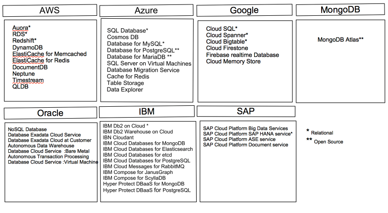

# Abstract Database Management On Multicloud Environments (with focus on Azure and AWS3)

Harsha Upadhyay, [fa19-516-147](https://github.com/cloudmesh-community/fa19-516-147/edit/master/project/report.md)

[Contributors](https://github.com/cloudmesh-community/fa19-516-147/graphs/contributors)

## Objective

Abstract database management on Multicloud environments for the NIST Big Data Reference Architecture AWS, Azure.

## Introduction

We will be providing database abstractions to host arbitrary databases in arbitrary 
cloud environments. In order to verify that the database provisioning multi cloud 
environment works, we will be providing a detailed test to manipulate data in database. 
This will include standard database functionality. The implementation is being conducted as 
part of API REST services and we will be using following clouds: 

1. Amazon
1. Azure 
1. and Local DB

We are providing pytests to deploy and execute the verification of the correctness of this services.

## Motivation 

Clouding computing is a market emerging trend. It provides on-demand availability of computer system resources, databases, storage etc. without direct maintenance of the platform by the user of cloud services.

A cloud database is a database which runs on a cloud computing platform. This platform can be private, public or hybrid.
When we talk about database, there are two models,
 
1. Traditional cloud model
2. Database as a service (DBaaS)

Cloud database as a service is becoming more and more populer these days because of the following main reasons:
 
* no physical infrastructure needed
* can be scaled quickly and efficiently
* mostly self-managed database with less administrative overhead

In this cloud computing project, cloud database as a service feature will be used with the objective of creating a functionality to deploy a database in multiple cloud environment. 
 
Here is a quick reference table giving the listing of database services available from different cloud services provider market leaders,  

## Architecture Diagram

## Technology Detail

 * Cloudmesh
 
   Cloudmesh is a multicloud architecture system which offers single architecture for using multiple cloud provides at the same time. Adbvantage of using cloudmesh is that it not only provides a REST based API but also commandline shell which makes easier to switch between clouds using single variable.
   
 * Open API 3.0.2
 
   APIs are sets of requirements that govern how one application can communicate and interact with another. connexion Open API 3 will be used in this project
   
 * Python Scripting
 
   Python is a most popular programming language which provides vast variety of libraries. Python can be used for developing web, desktop, scientific or any other application. Python will be used as scripting language in this project. 
   
 * AWS RDS SQL Server Express Edition & Azure SQL Database
 
   AWS and Azure are two market leading cloud services provider from Amazon and Microsoft respectively. AWS and Azure both offer number of database services. In project, relation SQL database from these cloud providers will be used. 

## Implementation Plan 

### Step 1: Database Object Creation
   Create Database objects like tables, views  on a cloud DB (Azure SQL Database )
   Python script to create objects 
 
### Step 2: Open API .yaml file
   Create a yaml file 
     * to get database , schema and DDL listing from one cloud environment (e.g Azure or AWS)
     * to create/copy database schema and DDL in other cloude environment 
        
   database.yaml
        
### Step3: Setup Config file
   Create a config file with environment detail for all environment used in the project
   
   cloudmesh.yaml 
  
### Step4 : Integration with cloudmesh 
   Set up command line 
 
## Progress
  * Azure account created
  * A database created on Azure SQL Database
  * Docker setup on local
  * Python script to test connection to databse and deploy table
  * AWS account creation
  * Code diretory & file strucure set up complete
  * Database.py created for get ,set Db and Schema
  * Database.py tested for get ,set Db and Schema

## Refernces

1. Cloud Computing by von Laszewski <https://github.com/cloudmesh-community/book/tree/master/books>
1. APIs and Python libraries <https://cloud.google.com/python/docs/reference/>
1. Google Cloud APIs <https://github.com/googleapis/google-cloud-python#google-cloud-python-client>
1. Cloudmesh Storage Open API <https://github.com/cloudmesh/cloudmesh-storage/blob/master/cloudmesh/storage/spec/openapi_storage.yaml>
1. NIST <https://github.com/cloudmesh/cloudmesh-nist/blob/master/spec/database.yaml>
1. Azure SQL Database <https://azure.microsoft.com/en-us/services/sql-database/>
1. Azure Cloud Database Services <https://azure.microsoft.com/en-us/product-categories/databases/>
1. AWS Cloud Database Services <https://aws.amazon.com/products/databases/>
1. Google Cloud Database Servcies <https://cloud.google.com/products/databases/?hl=pl>
1. Oracle Cloud Database Services <https://www.oracle.com/database/cloud-services.html>
1. IBM Cloud Database Services <https://www.ibm.com/cloud/databases>
1. MongoDB Cloud Databse Servcies <https://www.mongodb.com/cloud> 
