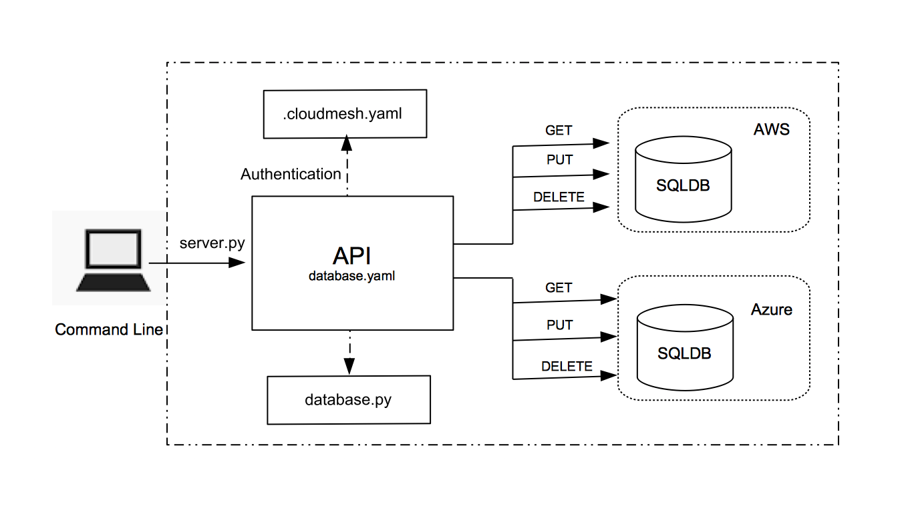

# Abstract Database Management On Multicloud Environments (with focus on Azure and AWS3)

Harsha Upadhyay, [fa19-516-147](https://github.com/cloudmesh-community/fa19-516-147/edit/master/project/report.md)

[Contributors](https://github.com/cloudmesh-community/fa19-516-147/graphs/contributors)

[Insights](https://github.com/cloudmesh-community/fa19-516-147/pulse)
 
[Project Code](https://github.com/cloudmesh-community/fa19-516-147/tree/master/project/project_code)

:o2: link to insights, code missing, see what others that have it do ...

:o2: remove phrases such as in this project. Nist does not have projects

:o2: please do not use html tags in text but only markdown

:o2: figures have captions in markdown but not in image, see
architecture image is wrong, image in motivation is wrong, this is not a
presentation but a professional document


## Objective

Abstract database management on Multicloud environments for the NIST Big
Data Reference Architecture AWS, Azure.

## Introduction

We will be providing database abstractions to host arbitrary databases
in arbitrary cloud environments. In order to verify that the database
provisioning multi cloud environment works, we will be providing a
detailed test to manipulate data in database. This will include standard
database functionality. The implementation is being conducted as part of
API REST services and we will be using following clouds:

1. Amazon
1. Azure 
1. and Local DB

We are providing pytest to deploy and execute the verification of the
correctness of this services.

## Motivation 

Clouding computing is a market emerging trend. It provides on-demand
availability of computer system resources, databases, storage etc.
without direct maintenance of the platform by the user of cloud
services.

A cloud database is a database which runs on a cloud computing platform.
This platform can be private, public or hybrid. When we talk about
database, there are two models,
 
1. Traditional cloud model
2. Database as a service (DBaaS)

Cloud database as a service is becoming more and more populer these days
because of the following main reasons:
 
* no physical infrastructure needed
* can be scaled quickly and efficiently
* mostly self-managed database with less administrative overhead

Cloud database as a service feature
will be used here with the objective of creating a functionality to deploy a
database in multiple cloud environment.
 
Here is a quick reference table giving the listing of database services
available from different cloud services provider market leaders,


## Architecture Diagram




## Technology Detail

 * Cloudmesh
 
   Cloudmesh is a multicloud architecture system which offers single
   architecture for using multiple cloud provides at the same time.
   Adbvantage of using cloudmesh is that it not only provides a REST
   based API but also commandline shell which makes easier to switch
   between clouds using single variable.
   
 * Open API 3.0.2
 
   APIs are sets of requirements that govern how one application can
   communicate and interact with another. connexion Open API 3 will be
   used.
   
 * Python Scripting
 
   Python is a most popular programming language which provides vast
   variety of libraries. Python can be used for developing web, desktop,
   scientific or any other application. Python will be used as scripting
   language.
   
 * Cloud databases
   
   AWS RDS SQL Server Express Edition & Azure SQL Database
 
   AWS and Azure are two market leading cloud services provider from
   Amazon and Microsoft respectively. AWS and Azure both offer number of
   database services. In project, relation SQL database from these cloud
   providers are used.

## Implementation Plan 

Abstract Database Management projects provides ability to perform
database operations as a service using Open API connexion service and
reading specification from yaml file designed based on existing NIST
template. Three main components of database service are:

* server.py 
* database.yaml
* database.py

### Step 1: Cloud Account and Database Instance Creation

Create Database instance and a database on a cloud  (Azure SQL Database
) AWS and Azure portal to create database instances and then create
databases.
 
### Step 2: Open API .yaml file

Use NIST database.yaml template file from NIST git directory

NIST database.yaml <https://github.com/cloudmesh/cloudmesh-nist/blob/master/spec/database.yaml>

* to get database , schema and DDL listing from one cloud environment
 (e.g Azure or AWS)
* to create/copy database schema and DDL in other cloud environment 
    
:o2: database.yaml


#### API Specification database.yaml

NIST API template database.yaml for this database abstraction project is
enhanced keeping relational SQL databases as main a focus. Relational
database terminology is being used here and functions to performed
database operations are  defined in a python file.

Key points to keep in mind while working with SQL databases:

* Data records are stored in a table in form of rows and columns.
* A set of tables makes up a schema
* A number of schemas create a database
* Many databases can be created on a single server

*SQL and NoSQL terminologies*: 

|**SQL Database**| **No SQL Database**|
-----------------|--------------------|
| Database       | Database           |
| Table          | Collection         |
| Row            | Document           |
| Column         | Field              |
| Schema (static)| Schema Dynamic     |


##### YAML File Path and Methods

Path: /database

No new features. 

* get

* put and delete database features have major security concerns and
  not allowed in majority of the cases however I was successful in
  creating a new database by adding put method to test feature

Path: /database/{dbname}/schema/{schname}

Changes area made in current version of NIST database.yaml template.

* get
* put
* delete

1. Added a name to the schema to perform following operations:

   *    search a named schema in a database if specified if not then list all schemas in a database
   *    create a named schema in a database
   *    delete a named schema in a database
   
    NIST3.2.0: 
    ```
    /database/{dbname}/schema/  
   
    ```
   
    Updated as: 
    
    ```
     /database/{dbname}/schema/{schname}
    ```

1. Operation ID changed to correct the function call
    
    NIST3.2.0: 
    
    ```
    "cloudmesh.database.get.schema" 
    "cloudmesh.database.put.schema" 
    "cloudmesh.database.delete" 
    ```
    
    Updated as: 
    
    ```
    "cloudmesh.database.get_schema" 
    "cloudmesh.database.put_schema" 
    "cloudmesh.database.delete_schema" 
    ```
   
Path: /database/{dbname}/schema/{schname}/table/{tblname}

This path is a new addition to the current NIST template. This is introduced to perform following table level operations:
 
 * search a named table in a database schema or list all tables in the database schema
 * create a named table in a database schema
 * delete a named table in a database schema
 
     NIST3.2.0: 
     
    ```
    not available  
    ```
   
    Updated as: 
    
    ```
    "cloudmesh.database.get_table" 
    "cloudmesh.database.put_table" 
    "cloudmesh.database.delete_table" 
   ```
   
Path: /database/{dbname}/schema/{schema}/table/{tblname}/data


* get
* put
* delete

1. Added a name to the schema and table to perform following operations:

   *    query a table from a given schema in a database 
   *    add records in a table from a given schema in a database
   *    delete records from a table in a named schema in a database
   
    NIST3.2.0: 
    
    ```
    /database/{dbname}/ 
    ```
   
    Updated as: 
    
    ```
    /database/{dbname}/schema/{schname}/table/{tblname}/data
   ```

1. Operation ID changed to correct the function call
    
    NIST3.2.0: 
    
    ```
    "cloudmesh.database.get.data" 
   "cloudmesh.database.put.data" 
   "cloudmesh.database.delete.data"    
    ```
   
    Updated as: 
    ```
    "cloudmesh.database.get_data" 
    "cloudmesh.database.put_data" 
    "cloudmesh.database.delete_data" 
    ```

1. Modified GET method to have flexible data pull from a table
 
    NIST3.2.0: returns the data response for a single field named as Status   
    
    Updated feature: 
  
    * pull data from table without limiting for only one predefined field
    * flexibility to set a return row count limit , current limit has been set as 10 records but can be changed based on implementation  

    Further Enhancements: 
    
    This feature can be further enhanced to perform variety of data
    pull reuqests ,data can be filter out for a given criteria based on
    a single field value
   
1. Modified put method to add data into table
 
    NIST3.2.0: adds the data for single column named status
    
    Updated feature:
    
    *  flexibility to add data for multiple fields in a table (current limit is set as 7 up to columns in table)
    *  removed dependency on a field name , any fields from a table can be chosen to add data set (current limit is set as up to 7 columns in table)
    
    Further Enhancements:
    
    This feature can further be enhanced to insert records from file 
    and also update feature can be added to update records based on a
    defined criteria


### Step 3: Cloudmesh Configuration setup
 
#### Add database section for aws and azure in cloudmesh.yaml   

Add database sections and introduce aws and azure config detail 

#### Update .cloudmesh.yaml on local install

 Add connection parameters
    
## Progress

* Azure account created
* A database created on Azure SQL Database
* Docker setup on local
* Python script to test connection to databse and deploy table
* AWS account creation
* Code directory & file structure set up complete
* Database.py created for get ,set Db and Schema
* Database.py tested for get ,set Db and Schema

## References

1. Cloud Computing by von Laszewski <https://github.com/cloudmesh-community/book/tree/master/books>
1. APIs and Python libraries <https://cloud.google.com/python/docs/reference/>
1. Google Cloud APIs <https://github.com/googleapis/google-cloud-python#google-cloud-python-client>
1. Cloudmesh Storage Open API <https://github.com/cloudmesh/cloudmesh-storage/blob/master/cloudmesh/storage/spec/openapi_storage.yaml>
1. NIST <https://github.com/cloudmesh/cloudmesh-nist/blob/master/spec/database.yaml>
1. Azure SQL Database <https://azure.microsoft.com/en-us/services/sql-database/>
1. Azure Cloud Database Services <https://azure.microsoft.com/en-us/product-categories/databases/>
1. AWS Cloud Database Services <https://aws.amazon.com/products/databases/>
1. Google Cloud Database Servcies <https://cloud.google.com/products/databases/?hl=pl>
1. Oracle Cloud Database Services <https://www.oracle.com/database/cloud-services.html>
1. IBM Cloud Database Services <https://www.ibm.com/cloud/databases>
1. MongoDB Cloud Database Services <https://www.mongodb.com/cloud> 
