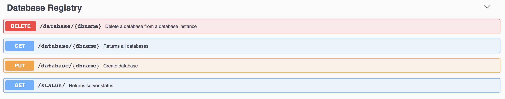
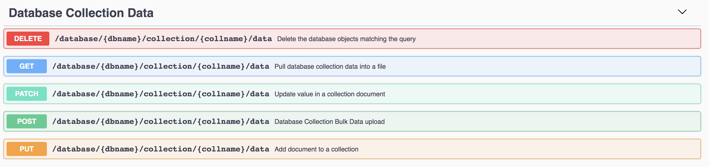
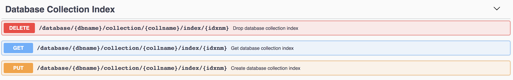

# Abstract Database Management On NoSQL Environments

Harsha Upadhyay, [fa19-516-147](https://github.com/cloudmesh-community/fa19-516-147/edit/master/project/report_616.md)

* [Contributors](https://github.com/cloudmesh-community/fa19-516-147/graphs/contributors)
* [Insights](https://github.com/cloudmesh-community/fa19-516-147/pulse)
* [Project Code](https://github.com/cloudmesh-community/fa19-516-147/tree/master/project/project_code/mongodb)

## Objective

Abstract database management on NoSQL environments for the NIST Big Data Reference Architecture and introduce new feature for database opeartions in abstract database management using SQL and NoSQL databases.

## Introduction

We will be providing database abstraction management focused on No SQL technology . 
This will also include addition of new functionality in order to perform database operations more effectively.

### NoSQL Database Management Open API Service Features

* Create a named database
* Delete a named database
* Get the list of databases available
* Create a named collection
* Create capped collection (fixed size) to support high throughput operations
* Delete a collection from a database
* Get the list of collections within a database
* Pull the data from a database collection into a file
* Upload data into a database collection from a file
* Insert a single record without file into database collection
* Update document value in a collection
* Delete a record or set of records from the database collection based on the condition 
* Create an Index on a database collection
* Delete an index from the collection
* Get the index list created on a database collection

## Implementation

Abstract Database Management projects provides ability to perform
database operations as a service using Open API connexion service and
reading specification from yaml file designed based on existing NIST
template. Three main components of database service are:

* server.py 
* database_nosql.yaml
* database_nosql.py

### Prerequisites

Copy files and scripts from git directory 
<https://github.com/cloudmesh-community/fa19-516-147/tree/master/project/project_code/mongodb>
```buildoutcfg
git clone https://github.com/cloudmesh-community/sp19-516-147.git
cd mongoapi
```

Install Python 3.8 
Python download <https://www.python.org/downloads/>

Run requirement.txt
```buildoutcfg
pip install -r requirements.txt
```
Install MongoDB 

```buildoutcfg
sh mongo_setup.sh
```
For Windows or other please follow steps from the link below
 <https://docs.mongodb.com/manual/installation/>
 
### Running the API

```buildoutcfg
sh app_start.sh
```
app_start is a wrapper scripts which calls server.py to start losthost

To perform operation go to Swagger UI

```buildoutcfg
open http://127.0.0.1:8080/cloudmesh/v3/ui/

```

## API Setup and Details

### Open API .yaml file

Use NIST database.yaml template file from NIST git directory

[NIST database.yaml](https://github.com/cloudmesh/cloudmesh-nist/blob/master/spec/database.yaml)

```buildoutcfg
database_NoSql.yaml
```

#### API Specification database_noSQL.yaml

NIST API template database.yaml for this database abstraction project is
enhanced keeping no SQL databases as main a focus. 

Key points to keep in mind while working with no SQL databases:


*SQL and NoSQL terminologies*: 

|**SQL Database**| **No SQL Database**|
-----------------|--------------------|
| Database       | Database           |
| Table          | Collection         |
| Row            | Document           |
| Column         | Field              |
| Schema (static)| Schema Dynamic     |


##### YAML File Path and Methods

Path: /database/{dbname}:

This path perform following database level operations:

* get
* put 
* delete

   ```
   cloudmesh.database.get
   cloudmesh.database.put
   cloudmesh.database.delete
   ```
Swagger UI 


Path: /database/{dbname}/collection/{collname}

This path is introduced to perform following collection level operations:
 
 * search a named collection in a database schema or list all collections in the database 
 * create a named collection in a database schema
 * delete a named collection in a database schema
 
   ```
    "cloudmesh.database.get_coll" 
    "cloudmesh.database.put_coll" 
    "cloudmesh.database.delete_coll" 
   ```
   
Swagger UI

   
Path: /database/{dbname}/collection/{collname}/data

This path performs following collection data level operations:

* get
* put
* Patch
* delete
* post

   ```
   cloudmesh.database.get_data
   cloudmesh.database.put_data
   cloudmesh.database.patch_data
   cloudmesh.database.delete_data
   cloudmesh.database.post_data
   ```
Swagger UI:


Path: /database/{dbname}/collection/{collname}/index/{idx}

* get
* put
* delete

   ```
   cloudmesh.database.index_get
   cloudmesh.database.index_put
   cloudmesh.database.index_delete
   ```
Swagger UI:


## References

MongoDB Cloud Database Services <https://www.mongodb.com/cloud>
MongoDB Documentaion <https://docs.mongodb.com/manual/reference/method>
Open API Specification <https://swagger.io/docs/specification/serialization/>